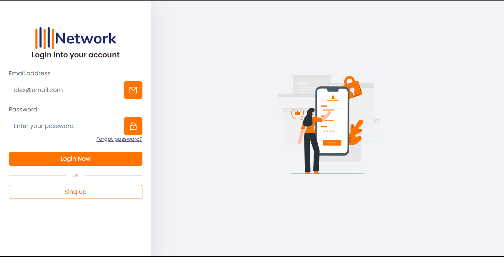

<h1 align="center">
  💻Network LoginPage
  
Login page utilizando Bootstrap

</h1>

## 🚨Sobre:
Projeto desenvolvido após a finalização do curso **Criando uma Landing Page responsiva** do Alura.

## 🔨Ferramentas:
 - HTML5
 - CSS3
 - Bootstrap